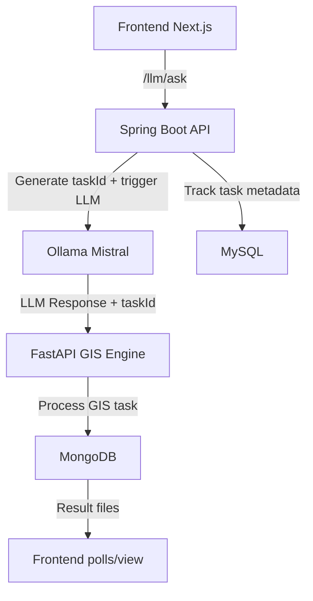

# 🛰️ ChainLLM

### 🔗 Natural Language to Geospatial Workflows via LLM Reasoning

A full-stack intelligent system that turns natural language queries into GIS workflows using chain-of-thought LLM reasoning, integrating MySQL, MongoDB, Spring Boot, FastAPI, and Ollama.

---

## 🚀 Overview

**ChainLLM** enables users to describe complex geospatial analysis tasks (e.g., *“Map flood zones near Brahmaputra river within 10km radius of schools”*) in plain English. It uses LLMs (like Mistral via Ollama) to generate step-by-step GIS workflows, passes them to a Python-powered GIS execution engine, and provides results—all tied to a unique `taskId`.

---

## 🧱 Architecture



---

## ⚙️ Tech Stack

| Layer         | Tech                                      |
| ------------- | ----------------------------------------- |
| Frontend      | **Next.js**, TailwindCSS                  |
| API Gateway   | **Spring Boot (Java)**                    |
| Auth/Task DB  | **MySQL**                                 |
| LLM           | **Ollama** (locally hosted, e.g. Mistral) |
| GIS Engine    | **FastAPI (Python)**                      |
| GIS Output DB | **MongoDB**                               |

---

## 🌐 Flow Summary

1. **User submits prompt** on frontend (`/llm/ask`).
2. **Spring Boot:**

   * Generates and returns a unique `taskId` immediately.
   * Sends prompt to **Ollama** (LLM inference).
3. **LLM Response** is sent to the **FastAPI GIS server** with the same `taskId`.
4. **Python GIS Engine**:

   * Parses LLM output.
   * Executes GIS operations (GeoPandas, Rasterio, etc.).
   * Stores logs/output in **MongoDB**.
5. **Frontend** polls or fetches final results using `taskId`.

---

## 📦 Project Structure

```
chainllm/
├── frontend/             # Next.js frontend
├── backend/              # Java Spring Boot
│   ├── controller/
│   ├── service/
│   └── model/ (MySQL entities)
├── gis-engine/           # FastAPI Python service
│   ├── routes/
│   ├── services/
│   └── models/ (MongoDB schemas)
```

---

## 📊 Databases

| System               | Purpose                     |
| -------------------- | --------------------------- |
| **MySQL (Java)**     | User auth, taskId tracking  |
| **MongoDB (Python)** | GIS output, logs, CoT steps |

---

## 🛠️ Run Locally

🧩 Prerequisites
Node.js (v18+ recommended) + npm
→ for running the Next.js frontend

Java 17+ and Maven
→ for the Spring Boot backend

Python 3.10+ and pip
→ for the FastAPI GIS engine

MySQL and MongoDB running locally
→ MySQL for Spring Boot, MongoDB for GIS logs

Ollama installed
→ run with ollama run mistral

Docker (optional)
→ for containerized setup (optional)

---

### 1. Start Spring Boot Server

```bash
cd backend
./mvnw spring-boot:run
```

---

### 2. Start FastAPI GIS Server

```bash
cd python GIS
uvicorn main:app --reload --port 8000
```

---

### 3. Start Frontend

```bash
cd frontend
npm install
npm run dev
```

---

## 📂 Sample Prompt

> “Generate a flood risk map for Guwahati with buffers around water bodies and elevation analysis.”

➡️ Returns:

* Chain-of-Thought JSON
* GIS logs
* Downloadable raster/vector results

---

## ✅ Features

* 🔐 JWT-based login (Next.js + Spring Boot)
* 🧠 Real-time LLM response via Ollama
* 🛰️ Automated GIS analysis with reasoning logs
* 📈 Result tracking via `taskId`
* 💽 Dual database architecture

---

## 📚 Datasets

* **OpenStreetMap (OSM)**
* **Bhoonidhi**
* **Sentinel-2**, **SRTM**, etc.

---

## 🧠 LLM Setup (Ollama)

Install Ollama: [https://ollama.com](https://ollama.com)
Run locally:

```bash
ollama run mistral
```

---

## 📥 API Endpoints

| Endpoint               | Method | Description                     |
| ---------------------- | ------ | ------------------------------- |
| `/llm/ask`             | POST   | Submit prompt, get `taskId`     |
| `/gis/process`         | POST   | Called internally by Java app   |
| `/auth/login`          | POST   | Auth endpoint                   |
| `/task/:taskId/result` | GET    | (Optional) fetch processed data |

---

## ✨ Future Features

* ✅ Frontend dashboard with result previews
* 🔁 Retry failed GIS jobs
* 🗃️ Archive & replay prompt history
* 🧾 Visual Chain-of-Thought logs
* 📊 GIS metric comparison dashboard

---

## 👥 Team Ashwamedh
| Name                  | Role                               | GitHub                                                                        |
| --------------------- | ---------------------------------- | ----------------------------------------------------------------------------- |
| **Debashis Mitra**    | Team Lead, Java Backend, DevOps    | [@Debashismitra01](https://github.com/Debashismitra01)                            |
| **Debankur Dutta**    | Python Backend, GIS                | [@Debankur04](https://github.com/Debankur04)  |
| **Susovan Sinhababu** | Frontend Developer                 | [@Susovan700](https://github.com/Susovan700)|
| **Anuska Kapuria**    | Documentation, PPTs & Presentation | [@Anuska1312](https://github.com/Anuska1312)  |

---
## License 
© 2025 Team Ashwamedh. All rights reserved.
This source code is proprietary and intended solely for evaluation purposes by the ISRO BAH committee.
Any reproduction, distribution, or use without explicit permission is strictly prohibited.

